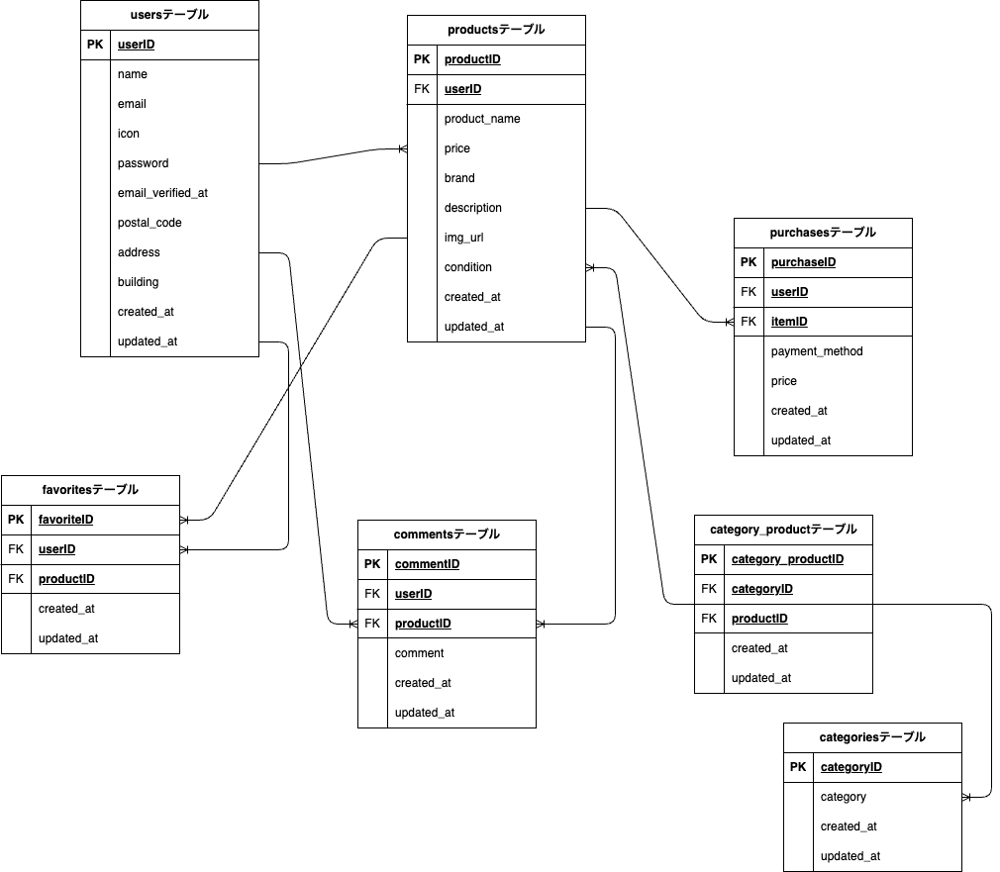

# coachtech-freemarket

## サービス名

coachtechフリマ

## サービス概要

ある企業が開発した独自のフリマアプリ

制作の背景と目的

アイテムの出品と購入を行うためのフリマアプリを開発する

目標

初年度でのユーザー数1000人達成

ターゲットユーザー

	10-30代の社会人

ターゲットブラウザ/os

	PC:Chrome/Firefox/Safari

作業範囲

	設計、コーディング、テスト

納品方法

	Githubでのリポジトリ共有

## 環境構築

## Dockerビルド

    1. git clone git@github.com:Tatsu1438/coachtech-freemarket.git
    2. cd coachtech-freemarket
    3. DockerDesktopアプリを立ち上げる
    4. docker-compose up -d --build

## Laravel環境構築

    docker-compose exec php bash
    composer install

## 環境変数

.env ファイルを作成して以下のように設定してください

    環境変数を以下に変更
	cp .env.example .env
	
	DB_CONNECTION=mysql
	DB_HOST=mysql
	DB_PORT=3306
	DB_DATABASE=freemarket_db
	DB_USERNAME=laravel_user
	DB_PASSWORD=laravel_pass
	
	MAIL_MAILER=smtp
	MAIL_HOST=mailhog
	MAIL_PORT=1025
	MAIL_USERNAME=null
	MAIL_PASSWORD=null
	MAIL_ENCRYPTION=null
	MAIL_FROM_ADDRESS=admin@example.com
	MAIL_FROM_NAME="${APP_NAME}"

	ADMIN_EMAIL=admin@example.com
	ADMIN_PASSWORD=admin12345

.env.testingが以下であることを確認

	DB_CONNECTION=mysql
	DB_HOST=freemarket_test_db
	DB_PORT=3306
	DB_DATABASE=laravel_test_db
	DB_USERNAME=laravel_user
	DB_PASSWORD=laravel_pass

## アプリケーションキーの作成

	php artisan key:generate

	php artisan config:clear
	php artisan cache:clear
	php artisan config:cache

## マイグレーション(test用と本番用)の作成&実行

	php artisan migrate
 	php artisan migrate --env=testing

## テスト方法

以下のコマンドでユニットテストを実行できます

	docker-compose exec php bash
	php artisan test --env=testing

## シーディングの作成&実行

    php artisan db:seed

## シンボリックリンクの作成

    php artisan storage:link

## 使用技術（実行環境）

PHP:7.4

mysql:8.0

nginx:1.21.1

Laravel:8.x

## 開発環境

URL:

・画面: http://localhost:8087

・ユーザー登録: http://localhost/

・phpMyAdmin: http://localhost:8083

・mailhog: http://localhost:8026
   

## ER図

　　

   

